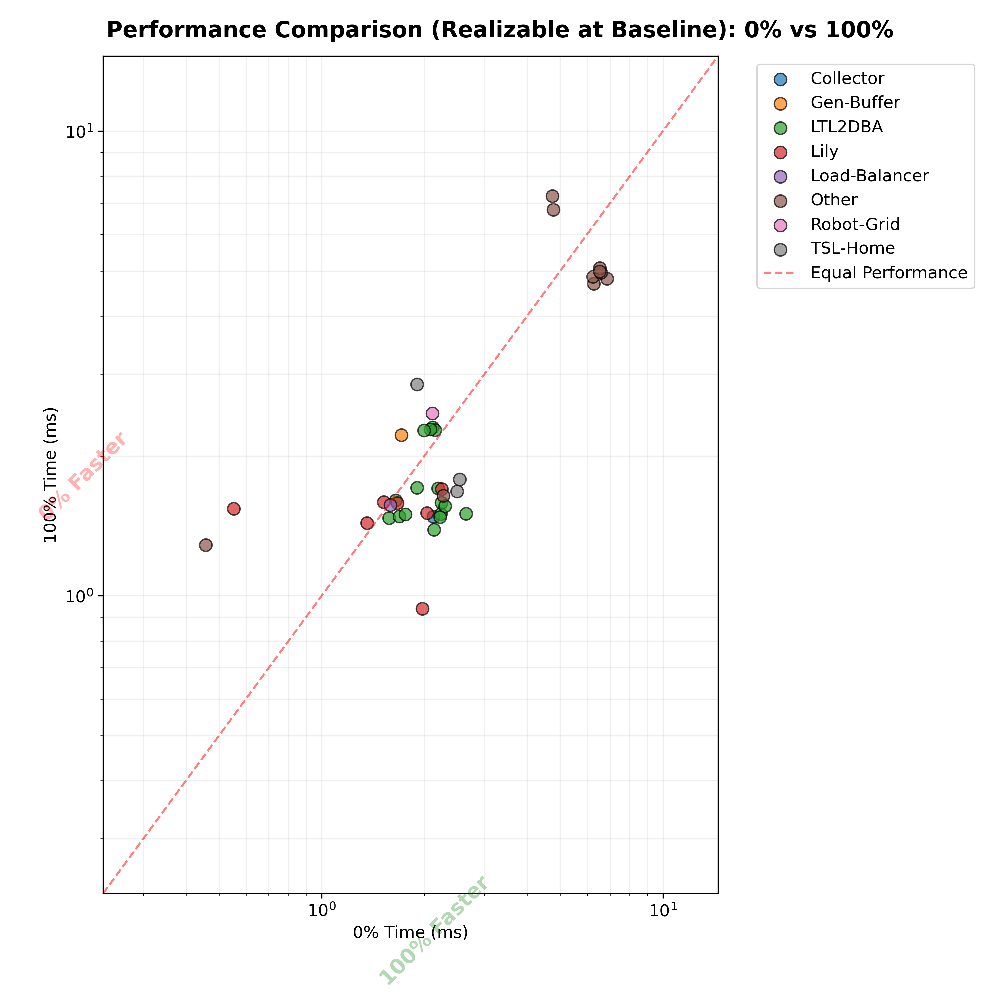
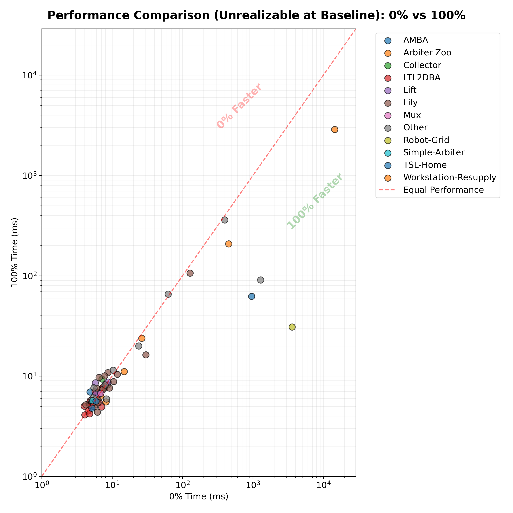

# LTLf Synthesis: Observability Impact Analysis

This report analyzes the impact of **Partial Observability** on LTLf synthesis performance and realizability. We compared two leading implementations (**Spot** and **Lucas/Syft**) across 180 benchmarks with varying degrees of input observability (0%, 25%, 50%, 75%, and 100% unobservable).

## Key Findings

1.  **Search Overhead is Negligible**: For benchmarks that remain solvable, neither tool experiences significant computational overhead from partial observability. The strategies found are either "blindable" or quickly detected as impossible.
2.  **Realizability is the Primary Bottleneck**: The main cost of partial observability is the loss of realizability. Benchmarks that require reacting to environment inputs (like logic conversions and games) quickly become unrealizable as uncertainty increases.
3.  **Fast Unrealizability Detection**: Both tools detect unrealizable cases significantly faster than they solve realizable ones, leading to an overall *decrease* in average execution time as observability drops.

---

## 1. Performance Overview: Spot (`spot:ltlf`)

| Observability | Total Tests | Realizable | Unrealizable | Avg Time (ms) | Realizability % |
| :--- | :--- | :--- | :--- | :--- | :--- |
| **0% (FO)** | 180 | 73 | 59 | 16.27 | 40.6% |
| **25%** | 180 | 66 | 71 | 15.96 | 36.7% |
| **50%** | 180 | 64 | 75 | 8.77 | 35.6% |
| **75%** | 180 | 64 | 75 | 3.57 | 35.6% |
| **100% (PO)** | 180 | 63 | 76 | 3.11 | 35.0% |

### Spot: FO vs 100% PO Comparison (Realizable vs Unrealizable)
By separating benchmarks based on their initial states, we can see that both "solved" and "impossible" paths are handled with minimal timing overhead by Spot.

#### Realizable Benchmarks (at FO)

#### Unrealizable Benchmarks (at FO)

---

## 2. Performance Overview: Lucas (`lucas:belief-states`)

| Observability | Total Tests | Realizable | Unrealizable | Avg Time (ms) | Realizability % |
| :--- | :--- | :--- | :--- | :--- | :--- |
| **0% (FO)** | 180 | 66 | 45 | 453.64 | 36.7% |
| **25%** | 180 | 54 | 84 | 443.04 | 30.0% |
| **50%** | 180 | 54 | 84 | 413.41 | 30.0% |
| **75%** | 180 | 54 | 84 | 260.84 | 30.0% |
| **100% (PO)** | 180 | 54 | 84 | 187.81 | 30.0% |

### Lucas: FO vs 100% PO Comparison (Realizable vs Unrealizable)
Lucas exhibits a similar split-scatter profile, showing robustness for the subset of benchmarks it can handle.

#### Realizable Benchmarks (at FO)

#### Unrealizable Benchmarks (at FO)

---

## 3. Combined Scalability Trends

The following grids show the execution time across all 5 observability levels for different benchmark families. Notice the flat lines for most families, indicating that observability level does not scale execution time exponentially for these types of specifications.

### Spot Trend Grid

### Lucas Trend Grid

---

## Conclusion
The results suggest that modern LTLf synthesis algorithms for partial observability (Belief-States and Projection) are highly efficient. The limiting factor for PO synthesis in industrial settings is not the tool's performance, but rather the **strength of the specification**—specs must be robust enough to allow for winning strategies that do not rely on hidden environment signals.
