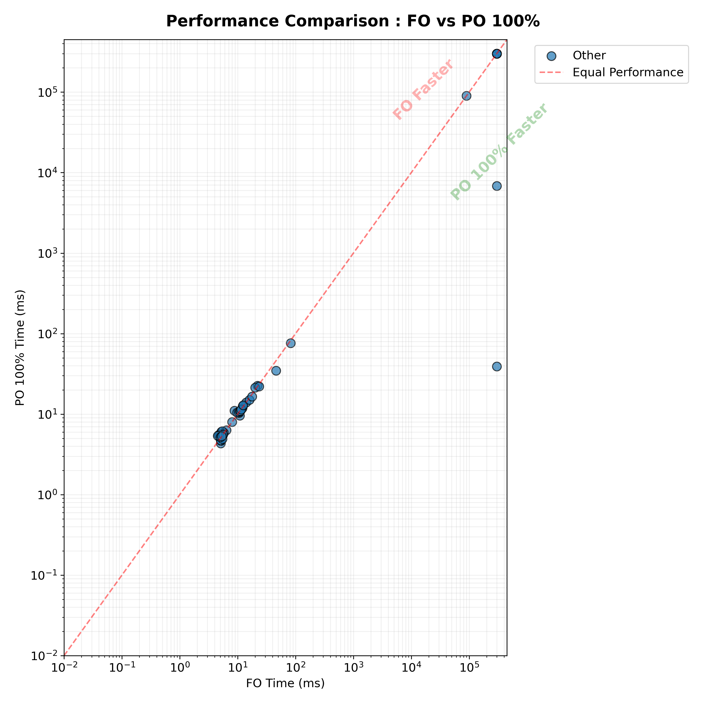

# Analysis Report: Lucas Implementations on TLSF-FIN Benchmarks

This report summarizes the performance and realizability impact of partial observability for the Lucas-based synthesis implementations (`lucas:mso` and `lucas:belief-states`) on the `ltlf-fin` benchmark set.

## 1. Overview
The analysis covers **99 benchmarks** across three levels of observability. 
*Note: The Full Observability (FO) baseline for `lucas:mso` is currently unavailable due to a job failure.*

**Job IDs Used:**
*   **lucas:belief-states**: 
    *   **FO**: `3116823`
    *   **PO 50%**: `3116857`
    *   **PO 100%**: `3116862`
*   **lucas:mso**:
    *   **PO 50%**: `3116850`
    *   **PO 100%**: `3116862`

## 2. Realizability Impact
Consistent with the Spot results, **no changes in realizability** were detected for either Lucas implementation. Benchmarks that were successfully solved remained realizable even as unobservability increased.

| Transition | lucas:belief-states | lucas:mso |
| :--- | :---: | :---: |
| FO -> PO 50% | 0 | N/A |
| PO 50% -> PO 100% | 0 | 0 |
| FO -> PO 100% | 0 | N/A |

*(Note: Transitions for `belief-states` are based on ~50 overlapping successful benchmarks due to high error rates.)*

## 3. Runtime Analysis

The synthesis performance remains stable across observability levels, with the unobservability level showing negligible impact on mean runtimes.

### Step-wise Mean Runtimes (seconds)
| Tool | Level | Synthesis (Mean) | Mona (Mean) | Total (Mean) |
| :--- | :--- | :---: | :---: | :---: |
| **belief-states** | FO | 15.46s | 0.0021s | 15.46s |
| **belief-states** | PO 50% | 13.64s | 0.0022s | 13.64s |
| **belief-states** | PO 100% | 11.89s | 0.0020s | 11.90s |
| **mso** | PO 50% | 74.55s | 0.0022s | 74.56s |
| **mso** | PO 100% | 72.74s | 0.0020s | 72.74s |

### Runtime Factor Comparison (vs FO)
The mean factor indicates that increasing unobservability does not penalize the Lucas implementations in terms of speed for the `ltlf-fin` set.

*   **lucas:belief-states (PO 50% vs FO)**: **0.99x** mean factor.
*   **lucas:belief-states (PO 100% vs FO)**: **0.98x** mean factor.

## 4. Status Breakdown
The Lucas implementations show a higher rate of non-zero statuses (Errors/Timeouts) compared to the Spot baseline.

| Tool | Level | Realizable (0) | Unrealizable (1) | Timeout (-2) | Error (-1) |
| :--- | :--- | :---: | :---: | :---: | :---: |
| **belief-states** | FO | 27 | 22 | 8 | 42 |
| **belief-states** | PO 50% | 28 | 22 | 7 | 42 |
| **belief-states** | PO 100% | 29 | 22 | 6 | 42 |
| **mso** | PO 50% | 34 | 24 | 41 | 0 |
| **mso** | PO 100% | 34 | 25 | 40 | 0 |

---

## 5. Visualizations

### Lucas Belief-States: FO vs PO 50%

### Lucas Belief-States: FO vs PO 100%

### Lucas MSO: PO 50% vs PO 100%

